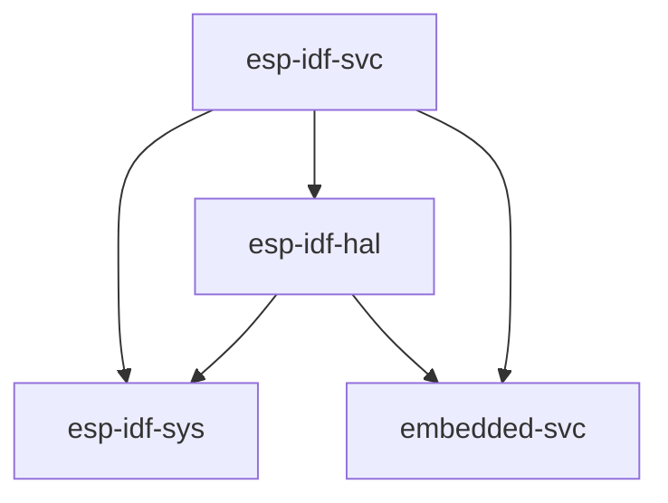

# Using the Standard Library (`std`)

Espressif provides a C-based development framework called [esp-idf][esp-idf-github] which has, or will have, support for all Espressif chips starting with the ESP32; note that this framework does _not_ support the ESP8266. See also [Support for Espressif Products][rust-esp-book-overview-index].

[rust-esp-book-overview-index]: index.md#support-for-espressif-products

`esp-idf`, in turn, provides a [newlib][newlib-env] environment with enough functionality to build the Rust standard library (`std`) on top of it. This is the approach that is being taken to enable `std` support on ESP devices.

[esp-idf-github]: https://github.com/espressif/esp-idf
[newlib-env]: https://sourceware.org/newlib/

## Current Support

As of now, the Espressif products supported by the [esp-idf framework][esp-idf-release-compatibility] are the ones supported for Rust `std` development.

[esp-idf-release-compatibility]: https://github.com/espressif/esp-idf#esp-idf-release-and-soc-compatibility/

When using `std`, you have access to a lot of features that exist in [esp-idf][esp-idf-github], including threads, mutexes and other synchronization primitives, collections, random number generation, sockets...

### Relevant `esp-rs` crates

| Repository            | Description                                                                                                   |
| --------------------- | ------------------------------------------------------------------------------------------------------------- |
| [esp-rs/embedded-svc] | Abstraction traits for embedded services (`WiFi`, `Network`, `Httpd`, `Logging`, etc.)                        |
| [esp-rs/esp-idf-svc]  | An implementation of [embedded-svc] using `esp-idf` drivers.                                                  |
| [esp-rs/esp-idf-hal]  | An implementation of the `embedded-hal` and other traits using the `esp-idf` framework.                       |
| [esp-rs/esp-idf-sys]  | Rust bindings to the `esp-idf` development framework. Gives raw (`unsafe`) access to drivers, Wi-Fi and more. |

The aforementioned crates have interdependencies, and this relationship can be seen below.

### When you might want to use the Standard Library (`std`)

- Enhanced functionality: If your embedded system requires extensive functionality such as support for networking protocols, file input/output (I/O), or intricate data structures, opting for the hosted-environment approach would be advantageous. By utilizing the std libraries, you can access a wide range of features that enable the development of complex applications with relative speed and efficiency.
- Improved portability: By leveraging the std crate, you can utilize a standardized set of application programming interfaces (APIs) that are compatible across various platforms and architectures. This simplifies the process of writing code that is portable and can be reused across different environments.
- Accelerated development: The std crate offers a comprehensive collection of tools and functionalities, allowing for rapid application development. With access to a broad range of capabilities, you can build applications swiftly and efficiently, minimizing the need to delve into intricate low-level details.

[embedded-svc]: https://github.com/esp-rs/embedded-svc
[esp-rs/embedded-svc]: https://github.com/esp-rs/embedded-svc
[esp-rs/esp-idf-svc]: https://github.com/esp-rs/esp-idf-svc
[esp-rs/esp-idf-sys]: https://github.com/esp-rs/esp-idf-sys
[esp-rs/esp-idf-hal]: https://github.com/esp-rs/esp-idf-hal

